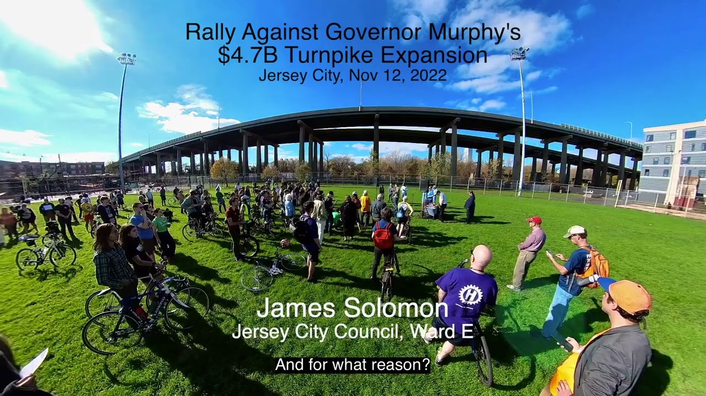

# Rally Against Governor Murphy's $4.7B Turnpike Expansion Through Jersey City

On Saturday, November 12, 2022, local officials, advocates, and citizens gathered for a rally opposing Governor Murphy's ill-advised, exorbitantly expensive highway expansion plan through the heart of Jersey City.

See excerpted speeches at [neighbor-ryan.org/turnpiketrap](https://neighbor-ryan.org/turnpiketrap), and **visit [turnpiketrap.org](https://turnpiketrap.org) to learn more and get involved.**

